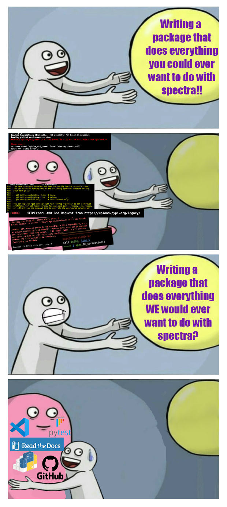

# analyze spectra, ez-style!

A package to read in HARPS-N spectra and run some simple analyses.

Installation:

1. `pip install spectra-ez-download==0.1.4`

2. `git clone https://github.com/Katlyn-Hobbs/spectra_ez_download.git`

3. Navigate towards `spectra_ez_download/spectra_ez_download` and open the `demo.ipynb` notebook

